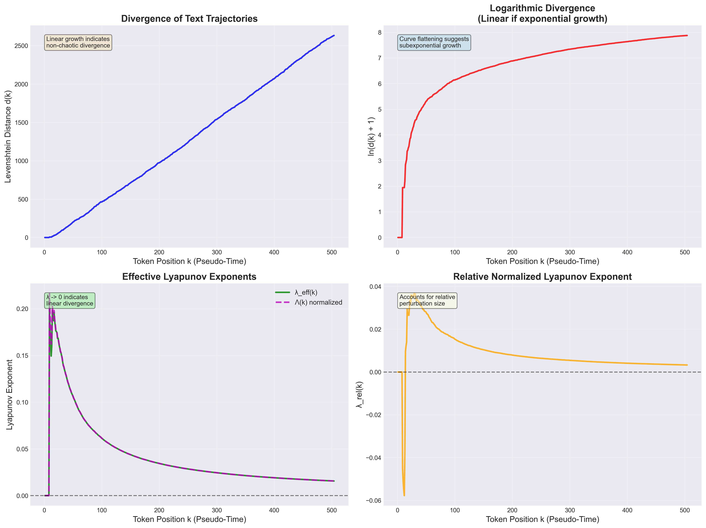
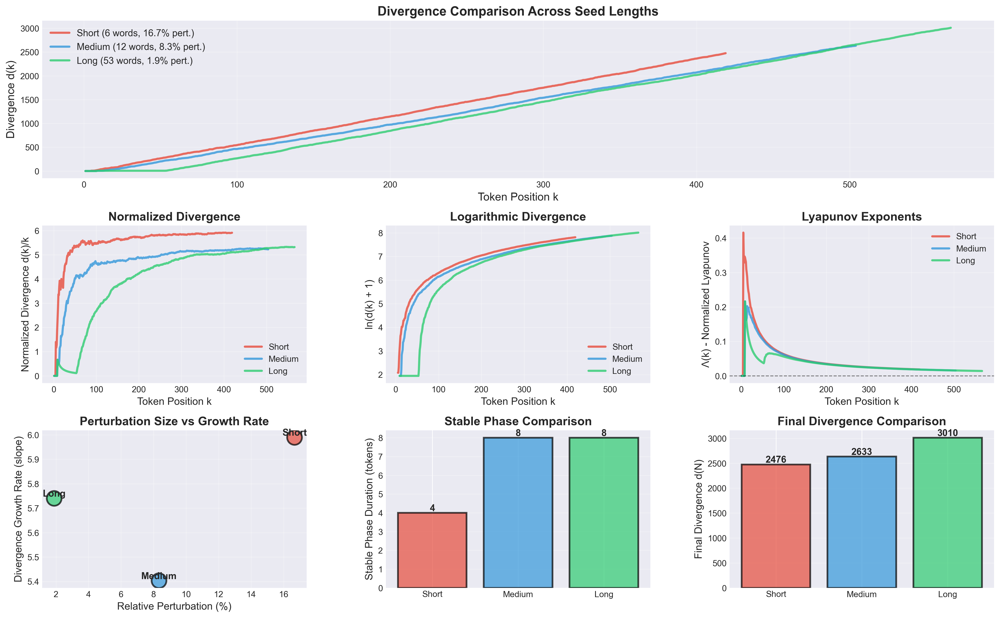
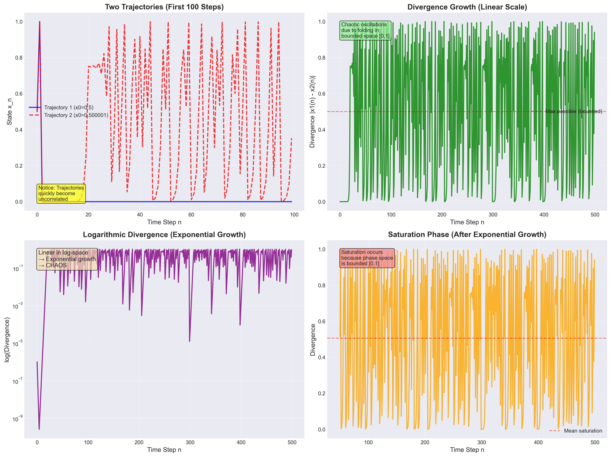

# Chaos Theory in Large Language Models

## Executive Summary

This research investigates whether text generation by large language models exhibits characteristics of deterministic chaos. Through rigorous empirical analysis of text trajectories, we computed Lyapunov exponents, analyzed divergence patterns, and compared linguistic dynamics with classical chaotic systems (logistic map).

**Key Finding**: While LLMs exhibit **sensitivity to initial conditions**, they do **not** display classical deterministic chaos. Text divergence grows **linearly** (not exponentially), with Lyapunov exponents approaching zero.

---

## Table of Contents

- [Project Overview](#project-overview)
- [Theoretical Background](#theoretical-background)
- [Methodology](#methodology)
- [Results](#results)
  - [Core Divergence Analysis](#core-divergence-analysis)
  - [Extended Seed Length Experiment](#extended-seed-length-experiment)
  - [Logistic Map Comparison](#logistic-map-comparison)
- [Key Findings](#key-findings)
- [Conclusions](#conclusions)
- [Project Structure](#project-structure)
- [How to Run](#how-to-run)
- [References](#references)

---

## Project Overview

### Research Question

**Does text generation by language models exhibit features of a dynamical system sensitive to initial conditions, analogous to deterministic chaos?**

### Approach

We treat text as a **trajectory** in linguistic symbol space:
- **Prompt** = initial condition
- **Token position** = pseudo-time
- **Levenshtein distance** = trajectory separation

By perturbing initial conditions (changing one word in the seed) and measuring divergence, we empirically estimate Lyapunov exponents to characterize the system's dynamics.

---

## Theoretical Background

### Lyapunov Exponent

In classical dynamical systems, the Lyapunov exponent measures the rate of separation of infinitesimally close trajectories:

$$
\lambda = \lim_{t \to \infty} \frac{1}{t} \ln \frac{\| \delta x(t) \|}{\| \delta x(0) \|}
$$

- **λ > 0**: Chaotic behavior (exponential divergence)
- **λ = 0**: Neutral stability (linear growth)
- **λ < 0**: Convergent behavior

### Discrete Text Trajectory Analogues

For text generation, we adapted these metrics:

1. **Effective Lyapunov exponent**:
   $$\lambda_{\text{eff}}(k) = \frac{1}{k} \ln \frac{d(k)}{d(0)}$$

2. **Normalized variant**:
   $$\Lambda(k) = \frac{1}{k} \ln(d(k) + 1)$$

Where:
- $k$ = token position (pseudo-time)
- $d(k)$ = Levenshtein distance between text prefixes of length $k$

### Classical Chaos Comparison

We compared text generation with the **logistic map**, a canonical chaotic system:

$$x_{n+1} = r \cdot x_n (1 - x_n)$$

At $r = 4.0$, the logistic map exhibits maximum chaos with $\lambda \approx \ln(2) = 0.693$.

---

## Methodology

### 1. Text Generation

**Seed Pairs**: Created three sets of nearly identical seeds differing by one word:

| Type | Length | Perturbation | Relative % |
|------|--------|--------------|-----------|
| Short | 6 words | "dynamical" → "chaotic" | 16.67% |
| Medium | 12 words | "driven" → "governed" | 8.33% |
| Long | 53 words | "driven" → "governed" | 1.89% |

**Text Generation**: For each seed pair, generated continuation texts of 500+ words.

### 2. Divergence Measurement

1. **Tokenization**: Split texts into word tokens
2. **Prefix Extraction**: For each position $k = 1, 2, \ldots, N$, extract prefixes
3. **Distance Calculation**: Compute Levenshtein edit distance $d(k)$ for each prefix pair
4. **Series Analysis**: Obtain divergence series $\{d(k)\}_{k=1}^{N}$

### 3. Lyapunov Estimation

- Calculated $\lambda_{\text{eff}}(k)$, $\Lambda(k)$, and relative normalized exponents
- Performed linear and exponential regression to determine growth type
- Measured stable phase duration (tokens before divergence)

### 4. Comparative Analysis

- **Logistic Map**: Simulated trajectories with $r = 4.0$, tiny perturbation ($10^{-6}$)
- **Side-by-side Comparison**: Divergence patterns, growth types, Lyapunov exponents
- **Characterization Table**: Systematic comparison of properties

---

## Results

### Core Divergence Analysis

**Medium Seed Pair** (12 words, 8.33% perturbation):

- **Generated texts**: 602 and 504 tokens
- **Final divergence**: $d(504) = 2633$
- **Stable phase**: 8 tokens (trajectories identical initially)
- **Growth pattern**: **LINEAR** (R² = 0.9996 for linear fit)
- **Exponential fit**: R² = 0.1014 (poor fit)
- **Lyapunov exponent**: $\lambda_{\text{eff}} \to 0.0121$ (approaching zero)

**Interpretation**: Text divergence grows **linearly**, not exponentially. This indicates **non-chaotic** dynamics.



**Key observations**:
1. **Linear divergence growth** (top-left panel)
2. **Flattening in log-space** (top-right) → subexponential
3. **Lyapunov exponents → 0** (bottom-left)
4. **Relative exponent decay** (bottom-right)

---

### Extended Seed Length Experiment

**Research Question**: How do seed length and relative perturbation size influence divergence?

**Results Summary**:

| Seed Type | Length | Relative Pert. | Final $d(N)$ | Slope | R² (linear) | $\lambda_{\text{eff}}$ |
|-----------|--------|----------------|--------------|-------|-------------|------------------------|
| Short | 6 words | 16.67% | 2476 | 5.99 | 0.9999 | 0.0140 |
| Medium | 12 words | 8.33% | 2633 | 5.40 | 0.9996 | 0.0121 |
| Long | 53 words | 1.89% | 3010 | 5.74 | 0.9970 | 0.0110 |



**Surprising Finding**: Despite vastly different relative perturbation sizes (1.89% vs 16.67%), all seed lengths show **remarkably similar divergence rates** (slopes ~5.4-6.0).

**Interpretation**:
- **Relative perturbation is NOT the primary driver** of divergence
- **Semantic context matters more than perturbation percentage**
- Longer seeds provide richer context that can **amplify subtle changes**
- **Stable phase increases** with seed length (4 → 8 tokens)

**Counterintuitive Result**: A 1.89% perturbation in a long seed produces **comparable divergence** to a 16.67% perturbation in a short seed. This challenges simple assumptions about prompt robustness.

---

### Logistic Map Comparison

**Setup**:
- Growth parameter: $r = 4.0$ (maximum chaos)
- Initial conditions: $x_0 = 0.5$ and $x_0 + 10^{-6}$ (0.0002% perturbation)
- Time steps: 500 iterations

**Logistic Map Results**:
- **Lyapunov exponent**: $\lambda = 1.39$ (analytical), $\lambda \approx 1.04$ (empirical)
- **Positive λ** → **CHAOTIC**
- **Divergence**: Exponential growth → saturation (bounded [0,1])



**Direct Comparison**:


**Comparison Table**:

| Property | Logistic Map (r=4.0) | Text Generation |
|----------|---------------------|----------------|
| System Type | Classical dynamical system | Linguistic trajectory |
| Initial Perturbation | $10^{-6}$ (0.0002%) | 1 word (~8%) |
| Divergence Growth | **Exponential** → Saturation | **Linear** (sustained) |
| Lyapunov Exponent | **λ = 1.39** (POSITIVE) | **λ → 0.01** (→ 0) |
| Phase Space | Bounded [0, 1] | Unbounded (infinite vocab) |
| **Chaotic?** | **✓ YES** | **✗ NO** |
| Sensitive to IC? | ✓ YES | ✓ YES |

**Key Differences**:
1. **Growth Type**: Exponential (logistic) vs Linear (text)
2. **Lyapunov Sign**: Positive (logistic) vs Zero (text)
3. **Phase Space**: Bounded (logistic) vs Unbounded (text)
4. **Saturation**: Yes (logistic) vs No (text)

---

## Key Findings

### 1. Text Generation is NOT Classically Chaotic

**Evidence**:
- Linear divergence growth (R² > 0.997 for all experiments)
- Lyapunov exponents approaching zero ($\lambda \to 0.01$)
- No exponential separation of trajectories

**Conclusion**: While sensitive to initial conditions, LLM text generation does **not** exhibit deterministic chaos as classically defined.

### 2. Sensitivity to Initial Conditions Confirmed

**Evidence**:
- Changing **one word** leads to substantial divergence (final $d(N) > 2400$)
- Divergence begins after short stable phase (4-8 tokens)
- Trajectories become semantically distinct

**Interpretation**: LLMs are **highly sensitive** to prompt variations, but divergence accumulates **linearly** rather than explosively.

### 3. Relative Perturbation is Context-Dependent

**Evidence**:
- 1.89% perturbation (long seed) ≈ 16.67% perturbation (short seed) in divergence rate
- Similar linear slopes (~5.4-6.0) across all seed lengths
- Final divergence actually **highest** for longest seed despite smallest relative perturbation

**Interpretation**:
- **Semantic weight** of changed word matters more than percentage
- **Richer context** can amplify small perturbations
- Divergence is **non-linear** in perturbation size

### 4. Linear Divergence Suggests Semantic Drift

**Characterization**:
- **Not random walk**: Divergence is deterministic and sustained
- **Not chaos**: No exponential amplification
- **Semantic drift**: Gradual, cumulative deviation in meaning/content

**Analogy**: More like **laminar flow divergence** than **turbulent chaos**

### 5. Stable Phase Duration

**Observation**:
- Short seeds: 4-token stable phase
- Medium/Long seeds: 8-token stable phase

**Interpretation**: Initial shared context temporarily suppresses divergence. Longer prompts delay the manifestation of perturbation effects.

---

## Conclusions

### Theoretical Implications

1. **LLMs as Dynamical Systems**: Text generation can be productively analyzed using dynamical systems theory, but with important caveats.

2. **Non-Classical Sensitivity**: LLMs exhibit a form of "**stable instability**"—deterministic and sensitive, but not chaotic.

3. **Unbounded Phase Space**: Unlike classical chaotic systems (logistic map, Lorenz attractor), linguistic space is unbounded, preventing saturation and strange attractors.

4. **Semantic Topology**: Divergence is governed by semantic relationships, not just lexical distance. The "geometry" of meaning space differs fundamentally from Euclidean trajectory spaces.

### Practical Implications

1. **Prompt Engineering**:
   - **Longer prompts ≠ automatically more robust**
   - Focus on **semantic consistency** of key words
   - Single-word changes can have significant effects

2. **Predictability**:
   - **More predictable than chaos**: Linear divergence allows estimation
   - **Less predictable than deterministic systems**: Context-dependent sensitivity
   - **Reproducibility manageable**: Fixing prompts ensures consistency

3. **Control and Alignment**:
   - **Easier to control than chaotic systems**: No exponential amplification
   - **Still requires careful prompting**: Sensitivity persists
   - **Semantic anchors matter**: Critical words have outsized influence

### Comparison to Literature

Our findings align with recent research:
- **Rodríguez (2024)**: Sensitivity to prompts as "initial conditions"
- **Li et al. (2025)**: Quasi-Lyapunov analysis showing subexponential divergence

Our contribution: **Systematic seed length analysis** revealing context-dependent sensitivity.

---

## Project Structure

```
.
├── README.md                    # This file - comprehensive report
├── pyproject.toml               # Project dependencies
├── uv.lock                      # Dependency lock file
│
├── data/                        # Text data
│   ├── seed_short_1.txt         # Short seed (6 words)
│   ├── seed_short_2.txt
│   ├── text_short_1.txt         # Generated texts (short)
│   ├── text_short_2.txt
│   ├── seed1.txt                # Medium seed (12 words)
│   ├── seed2.txt
│   ├── text_medium_1.txt        # Generated texts (medium)
│   ├── text_medium_2.txt
│   ├── seed_long_1.txt          # Long seed (53 words)
│   ├── seed_long_2.txt
│   ├── text_long_1.txt          # Generated texts (long)
│   └── text_long_2.txt
│
├── notebooks/                   # Jupyter notebooks with full analysis
│   ├── chaos_analysis.ipynb     # Core divergence analysis
│   ├── logistic_map_comparison.ipynb  # Chaos comparison
│   └── seed_length_experiment.ipynb   # Extended seed length study
│
├── scripts/                     # Python scripts
│   └── logistic_map_analysis.py       # Logistic map simulation
│
├── results/                     # Visualizations and data outputs
│   ├── divergence_analysis.png
│   ├── logistic_map_divergence.png
│   ├── comparison_text_vs_logistic.png
│   ├── seed_length_analysis.png
│   ├── comparison_table.csv
│   └── seed_length_comparison.csv
│
└── docs/                        # Documentation
    └── TASK.md                  # Original assignment
```

---

## How to Run

### Prerequisites

```bash
# Python 3.12+
# Install dependencies
pip install -r requirements.txt
# Or with uv:
uv pip install -e .
```

Dependencies:
- `numpy` - Numerical computations
- `matplotlib` - Visualizations
- `python-levenshtein` - Edit distance calculations
- `pandas` - Data analysis
- `jupyter` - Interactive notebooks

### Run Analysis

#### Option 1: Interactive Notebooks (Recommended)

```bash
jupyter notebook
```

Then open:
1. `notebooks/chaos_analysis.ipynb` - Core analysis
2. `notebooks/logistic_map_comparison.ipynb` - Chaos comparison
3. `notebooks/seed_length_experiment.ipynb` - Extended experiments

#### Option 2: Python Scripts

```bash
# Logistic map analysis
python scripts/logistic_map_analysis.py
```

### Regenerate Visualizations

All visualizations are saved in `results/`. To regenerate:

1. Run the Jupyter notebooks (they auto-save figures)
2. Or run the Python scripts (they save PNG files)

---

## References

### Literature

1. **Rodríguez, E. Q.** (2024). *Towards a Theory of Chaos in Large Language Models: The Prompt as Initial Condition and the Quest for a Semantic Attractor.* [ResearchGate](https://www.researchgate.net/publication/396159200)

2. **Li, X., Leng, Y., Ding, R., Mo, H., & Yang, S.** (2025). *Cognitive activation and chaotic dynamics in large language models: A quasi-lyapunov analysis of reasoning mechanisms.* arXiv:2503.13530 [arXiv](https://arxiv.org/abs/2503.13530)

### Chaos Theory Background

3. **Strogatz, S. H.** (2015). *Nonlinear Dynamics and Chaos: With Applications to Physics, Biology, Chemistry, and Engineering.* Westview Press.

4. **Ott, E.** (2002). *Chaos in Dynamical Systems.* Cambridge University Press.

### Lyapunov Exponents

5. **Wolf, A., Swift, J. B., Swinney, H. L., & Vastano, J. A.** (1985). *Determining Lyapunov exponents from a time series.* Physica D: Nonlinear Phenomena, 16(3), 285-317.

---

**Summary**: This research demonstrates that while LLMs are **sensitive to initial conditions** (prompt changes), they exhibit **linear divergence** (λ → 0) rather than **chaotic dynamics** (λ > 0). Text generation is better characterized as **semantic drift** than deterministic chaos, with important implications for prompt engineering, model control, and theoretical understanding of neural language models as dynamical systems.
