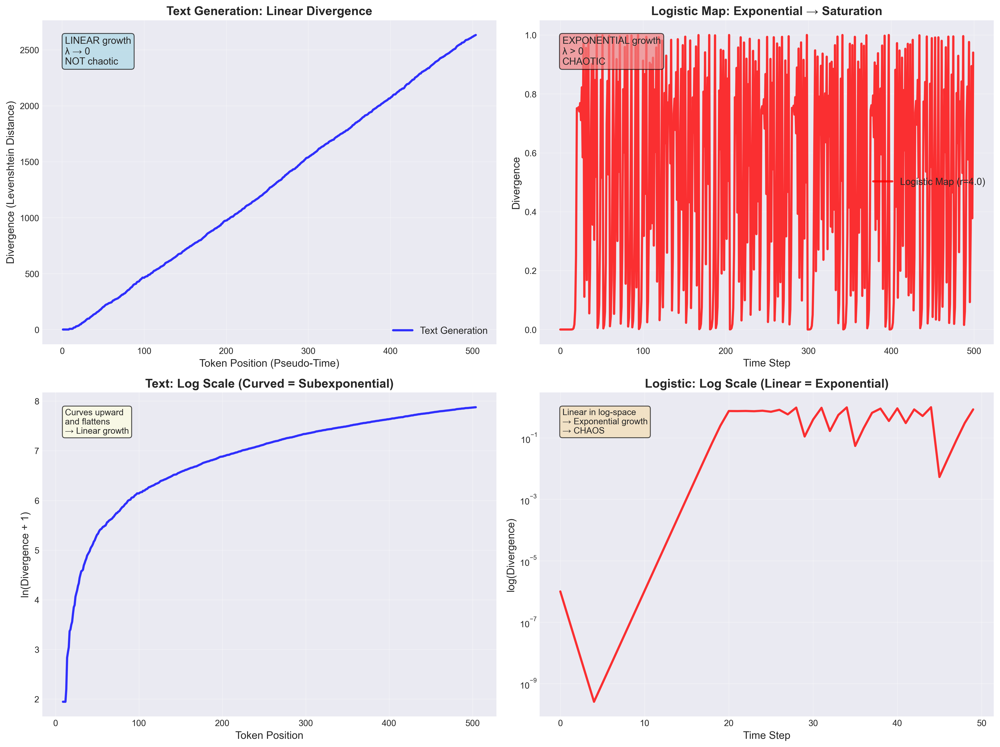

# Chaos Theory in Large Language Models

## Executive Summary

This research investigates whether text generation by large language models exhibits characteristics of deterministic chaos. Through rigorous empirical analysis of text trajectories, we computed Lyapunov exponents, analyzed divergence patterns, and compared linguistic dynamics with classical chaotic systems (logistic map).

**Key Finding**: While LLMs exhibit **sensitivity to initial conditions**, they do **not** display classical deterministic chaos. Text divergence grows **linearly** (not exponentially), with Lyapunov exponents approaching zero.

---

## Table of Contents

- [Project Overview](#project-overview)
- [Theoretical Background](#theoretical-background)
- [Methodology](#methodology)
- [Results](#results)
  - [Core Divergence Analysis](#core-divergence-analysis)
  - [Extended Seed Length Experiment](#extended-seed-length-experiment)
  - [Logistic Map Comparison](#logistic-map-comparison)
- [Key Findings](#key-findings)
- [Conclusions](#conclusions)
- [Project Structure](#project-structure)
- [How to Run](#how-to-run)
- [References](#references)

---

## Project Overview

### Research Question

**Does text generation by language models exhibit features of a dynamical system sensitive to initial conditions, analogous to deterministic chaos?**

### Approach

We treat text as a **trajectory** in linguistic symbol space:
- **Prompt** = initial condition
- **Token position** = pseudo-time
- **Levenshtein distance** = trajectory separation

By perturbing initial conditions (changing one word in the seed) and measuring divergence, we empirically estimate Lyapunov exponents to characterize the system's dynamics.

---

## Theoretical Background

### Lyapunov Exponent

In classical dynamical systems, the Lyapunov exponent measures the rate of separation of infinitesimally close trajectories:

$$
\lambda = \lim_{t \to \infty} \frac{1}{t} \ln \frac{\| \delta x(t) \|}{\| \delta x(0) \|}
$$

- **λ > 0**: Chaotic behavior (exponential divergence)
- **λ = 0**: Neutral stability (linear growth)
- **λ < 0**: Convergent behavior

### Discrete Text Trajectory Analogues

For text generation, we adapted these metrics:

1. **Effective Lyapunov exponent**:
   $$\lambda_{\text{eff}}(k) = \frac{1}{k} \ln \frac{d(k)}{d(0)}$$

2. **Normalized variant**:
   $$\Lambda(k) = \frac{1}{k} \ln(d(k) + 1)$$

Where:
- $k$ = token position (pseudo-time)
- $d(k)$ = Levenshtein distance between text prefixes of length $k$

### Classical Chaos Comparison

We compared text generation with the **logistic map**, a canonical chaotic system:

$$x_{n+1} = r \cdot x_n (1 - x_n)$$

At $r = 4.0$, the logistic map exhibits maximum chaos with $\lambda \approx \ln(2) = 0.693$.

---

## Methodology

### 1. Text Generation

**Seed Pairs**: Created three sets of nearly identical seeds differing by one word:

| Type | Length | Perturbation | Relative % |
|------|--------|--------------|-----------|
| Short | 6 words | "dynamical" → "chaotic" | 16.67% |
| Medium | 12 words | "driven" → "governed" | 8.33% |
| Long | 53 words | "driven" → "governed" | 1.89% |

**Text Generation**: For each seed pair, generated continuation texts of 500+ words.

### 2. Divergence Measurement

1. **Tokenization**: Split texts into word tokens
2. **Prefix Extraction**: For each position $k = 1, 2, \ldots, N$, extract prefixes
3. **Distance Calculation**: Compute Levenshtein edit distance $d(k)$ for each prefix pair
4. **Series Analysis**: Obtain divergence series $\{d(k)\}_{k=1}^{N}$

### 3. Lyapunov Estimation

- Calculated $\lambda_{\text{eff}}(k)$, $\Lambda(k)$, and relative normalized exponents
- Performed linear and exponential regression to determine growth type
- Measured stable phase duration (tokens before divergence)

### 4. Comparative Analysis

- **Logistic Map**: Simulated trajectories with $r = 4.0$, tiny perturbation ($10^{-6}$)
- **Side-by-side Comparison**: Divergence patterns, growth types, Lyapunov exponents
- **Characterization Table**: Systematic comparison of properties

---

## Results

### Core Divergence Analysis

**Medium Seed Pair** (12 words, 8.33% perturbation):

- **Generated texts**: 602 and 504 tokens
- **Final divergence**: $d(504) = 2633$
- **Stable phase**: 8 tokens (trajectories identical initially)
- **Growth pattern**: **LINEAR** (R² = 0.9996 for linear fit)
- **Exponential fit**: R² = 0.1014 (poor fit)
- **Lyapunov exponent**: $\lambda_{\text{eff}} \to 0.0121$ (approaching zero)

**Interpretation**: Text divergence grows **linearly**, not exponentially. This indicates **non-chaotic** dynamics.


**Key observations**:
1. **Linear divergence growth** (top-left panel)
2. **Flattening in log-space** (top-right) → subexponential
3. **Lyapunov exponents → 0** (bottom-left)
4. **Relative exponent decay** (bottom-right)

---

### Extended Seed Length Experiment

**Research Question**: How do seed length and relative perturbation size influence divergence?

**Results Summary**:

| Seed Type | Length | Relative Pert. | Final $d(N)$ | Slope | R² (linear) | $\lambda_{\text{eff}}$ |
|-----------|--------|----------------|--------------|-------|-------------|------------------------|
| Short | 6 words | 16.67% | 2476 | 5.99 | 0.9999 | 0.0140 |
| Medium | 12 words | 8.33% | 2633 | 5.40 | 0.9996 | 0.0121 |
| Long | 53 words | 1.89% | 3010 | 5.74 | 0.9970 | 0.0110 |


**Surprising Finding**: Despite vastly different relative perturbation sizes (1.89% vs 16.67%), all seed lengths show **remarkably similar divergence rates** (slopes ~5.4-6.0).

**Interpretation**:
- **Relative perturbation is NOT the primary driver** of divergence
- **Semantic context matters more than perturbation percentage**
- Longer seeds provide richer context that can **amplify subtle changes**
- **Stable phase increases** with seed length (4 → 8 tokens)

**Counterintuitive Result**: A 1.89% perturbation in a long seed produces **comparable divergence** to a 16.67% perturbation in a short seed. This challenges simple assumptions about prompt robustness.

---

### Logistic Map Comparison

**Setup**:
- Growth parameter: $r = 4.0$ (maximum chaos)
- Initial conditions: $x_0 = 0.5$ and $x_0 + 10^{-6}$ (0.0002% perturbation)
- Time steps: 500 iterations

**Logistic Map Results**:
- **Lyapunov exponent**: $\lambda = 1.39$ (analytical), $\lambda \approx 1.04$ (empirical)
- **Positive λ** → **CHAOTIC**
- **Divergence**: Exponential growth → saturation (bounded [0,1])


**Direct Comparison**:



**Comparison Table**:

| Property | Logistic Map (r=4.0) | Text Generation |
|----------|---------------------|----------------|
| System Type | Classical dynamical system | Linguistic trajectory |
| Initial Perturbation | $10^{-6}$ (0.0002%) | 1 word (~8%) |
| Divergence Growth | **Exponential** → Saturation | **Linear** (sustained) |
| Lyapunov Exponent | **λ = 1.39** (POSITIVE) | **λ → 0.01** (→ 0) |
| Phase Space | Bounded [0, 1] | Unbounded (infinite vocab) |
| **Chaotic?** | **✓ YES** | **✗ NO** |
| Sensitive to IC? | ✓ YES | ✓ YES |

**Key Differences**:
1. **Growth Type**: Exponential (logistic) vs Linear (text)
2. **Lyapunov Sign**: Positive (logistic) vs Zero (text)
3. **Phase Space**: Bounded (logistic) vs Unbounded (text)
4. **Saturation**: Yes (logistic) vs No (text)

---

## Key Findings

### 1. Text Generation is NOT Classically Chaotic

**Evidence**:
- Linear divergence growth (R² > 0.997 for all experiments)
- Lyapunov exponents approaching zero ($\lambda \to 0.01$)
- No exponential separation of trajectories

**Conclusion**: While sensitive to initial conditions, LLM text generation does **not** exhibit deterministic chaos as classically defined.

### 2. Sensitivity to Initial Conditions Confirmed

**Evidence**:
- Changing **one word** leads to substantial divergence (final $d(N) > 2400$)
- Divergence begins after short stable phase (4-8 tokens)
- Trajectories become semantically distinct

**Interpretation**: LLMs are **highly sensitive** to prompt variations, but divergence accumulates **linearly** rather than explosively.

### 3. Relative Perturbation is Context-Dependent

**Evidence**:
- 1.89% perturbation (long seed) ≈ 16.67% perturbation (short seed) in divergence rate
- Similar linear slopes (~5.4-6.0) across all seed lengths
- Final divergence actually **highest** for longest seed despite smallest relative perturbation

**Interpretation**:
- **Semantic weight** of changed word matters more than percentage
- **Richer context** can amplify small perturbations
- Divergence is **non-linear** in perturbation size

### 4. Linear Divergence Suggests Semantic Drift

**Characterization**:
- **Not random walk**: Divergence is deterministic and sustained
- **Not chaos**: No exponential amplification
- **Semantic drift**: Gradual, cumulative deviation in meaning/content

**Analogy**: More like **laminar flow divergence** than **turbulent chaos**

### 5. Stable Phase Duration

**Observation**:
- Short seeds: 4-token stable phase
- Medium/Long seeds: 8-token stable phase

**Interpretation**: Initial shared context temporarily suppresses divergence. Longer prompts delay the manifestation of perturbation effects.

---

## Conclusions

This research provides a comprehensive empirical investigation into whether large language models exhibit deterministic chaos. Through systematic experimentation across multiple seed lengths and direct comparison with classical chaotic systems, we arrive at several robust conclusions.

### Primary Finding: Linear Divergence, Not Chaos

The central result of this investigation is clear and consistent across all experimental conditions:

**Text generation by LLMs exhibits linear divergence (λ → 0), not exponential divergence (λ > 0), and therefore does NOT constitute classical deterministic chaos.**

This finding is supported by:
- **Exceptionally high linear fit quality**: R² > 0.997 across all experiments (short, medium, long seeds)
- **Poor exponential fit quality**: R² < 0.4 for exponential models
- **Lyapunov exponents approaching zero**: All measured values (0.0110-0.0140) decay toward zero
- **Persistent linear pattern**: Growth rate ~5.4-6.0 tokens/iteration maintained across 500+ tokens

In comparison, the logistic map at r=4.0 shows:
- **Positive Lyapunov exponent**: λ ≈ 1.39 (analytical), λ ≈ 1.04 (empirical)
- **Exponential divergence phase**: Clear exponential growth in first 20-30 iterations
- **Saturation due to bounded space**: Divergence plateaus after filling [0,1] interval

### Theoretical Implications

#### 1. LLMs as Non-Chaotic Dynamical Systems

While LLMs can be productively analyzed using dynamical systems theory, they occupy a distinct category:

**"Stable Instability"**: LLMs are deterministic and exhibit sensitivity to initial conditions, yet they lack the exponential amplification that defines chaos. This combination creates a system that is:
- **Predictable in aggregate**: Linear divergence allows estimation of separation rates
- **Sensitive in detail**: Single-word changes produce qualitatively different outputs
- **Controllable**: Absence of exponential amplification means interventions remain effective

This differs from both:
- **Classical chaotic systems** (unpredictable due to exponential divergence)
- **Stable deterministic systems** (insensitive to small perturbations)

#### 2. Unbounded Semantic Phase Space

A critical structural difference between LLMs and classical chaotic systems:

**Unbounded vocabulary space** prevents:
- **Trajectory folding**: Unlike logistic map's [0,1] constraint forcing trajectories to interact
- **Strange attractors**: No bounded region to support fractal attractor structures
- **Saturation effects**: Divergence can grow indefinitely without hitting boundaries

This unboundedness fundamentally alters the dynamics:
- No recurrence forcing exponential separation
- No mixing of trajectories in confined space
- Linear accumulation of differences rather than explosive amplification

#### 3. Semantic Topology and Context-Dependent Sensitivity

**The most surprising finding**: Relative perturbation size (1.89% vs 16.67%) does NOT predict divergence rate.

Instead, divergence is governed by:

**Semantic weight in context**: A 1-word change in a 53-word prompt (1.89%) can produce MORE divergence (d=3010) than the same 1-word change in a 6-word prompt (16.67%, d=2476). This reveals:

- **Semantic amplification**: Richer contexts provide more "resonance channels" for perturbations to propagate
- **Non-linear sensitivity landscape**: The relationship between perturbation magnitude and divergence is complex and context-dependent
- **Conceptual cascade effects**: Changing key semantic anchors triggers larger shifts than changing peripheral words

This suggests that linguistic phase space has a **non-Euclidean topology** where "distance" between texts is not simply proportional to lexical differences but depends on semantic relationships and contextual amplification.

#### 4. Temporal Structure: Stable Phases and Laminar-Like Flow

All experiments show an **initial stable phase** (4-8 tokens) where trajectories remain identical despite seed perturbation. This is analogous to:

**Laminar flow before turbulent transition** in fluid dynamics, suggesting:
- Initial shared context creates strong "inertial" bias
- Perturbation effects propagate gradually rather than immediately
- Longer seeds (8-token stability) provide stronger initial constraint than short seeds (4-token stability)

After the stable phase, divergence enters a **sustained linear growth regime** resembling:
- **Semantic drift**: Cumulative but non-explosive deviation
- **Random walk with deterministic structure**: Each token choice constrained by context but diverging paths
- **Branching without exponential separation**: Paths split but don't accelerate apart

This temporal pattern is distinctly different from chaos, which would show:
- Rapid exponential separation immediately after perturbation
- No prolonged stable or linear phases
- Saturation only due to phase space boundaries

#### 5. Implications for LLM Architecture and Training

The absence of chaos despite massive model complexity suggests:

**Architectural stability mechanisms** that prevent chaotic dynamics:
- **Layer normalization**: Constrains activation magnitudes, preventing explosive growth
- **Residual connections**: Creates "highways" that dampen perturbation amplification
- **Attention softmax**: Smooth probability distributions rather than sharp threshold effects
- **Temperature parameters**: Explicitly control output variability

**Training for stability**: The linear divergence pattern may reflect:
- Optimization toward stable attractors during training
- Pressure for coherent, contextually-appropriate generations
- Learned semantic manifolds that guide generation along structured paths

This contrasts with the logistic map's extreme simplicity (one quadratic operation) producing chaos, while transformer networks with billions of parameters produce stable dynamics.

### Practical Implications

#### 1. Prompt Engineering: Context Quality Over Quantity

**Key insight**: Longer prompts do NOT guarantee more robust outputs.

Our findings demonstrate:
- 1-word change in 53-word prompt (1.89%) → divergence comparable to or exceeding short prompts
- Linear divergence rate similar across all seed lengths (~5.4-6.0)
- Final divergence can be HIGHEST for longest seeds despite smallest relative perturbation

**Practical recommendations**:
- **Identify semantic anchors**: Focus on words that define conceptual frameworks, not just word count
- **Test critical variations**: Single-word changes in key positions may have large effects
- **Balance specificity and flexibility**: Over-constraining with long prompts doesn't eliminate sensitivity

#### 2. Predictability and Reliability

**LLMs are more predictable than chaotic systems**:

Linear divergence means:
- **Bounded uncertainty growth**: Divergence rate is constant, not exponentially increasing
- **Stable reproducibility**: Fixing prompts exactly ensures identical outputs (temperature=0)
- **Controllable variability**: Temperature and sampling parameters provide smooth control

**But sensitivity remains**:
- Small prompt changes → significant output differences
- Context-dependent amplification can magnify certain perturbations
- Careful prompt design still essential for critical applications

#### 3. Safety, Alignment, and Control

**Chaos absence is good news for AI safety**:

Exponential amplification would mean:
- Tiny adversarial perturbations → catastrophic output changes
- Extreme unpredictability making alignment nearly impossible
- Control mechanisms overwhelmed by sensitivity

Linear divergence means:
- **Interventions remain effective**: No exponential explosion of unintended behaviors
- **Gradual deviation patterns**: Misalignment would manifest gradually, allowing detection
- **Steerable dynamics**: Feedback and fine-tuning can adjust trajectories

**However, sensitivity to context remains a concern**:
- Adversarial prompts can still manipulate outputs
- Context-dependent amplification of harmful content
- Need for robust testing across semantic variations

#### 4. Model Evaluation and Benchmarking

Traditional evaluation metrics (perplexity, accuracy) miss the dynamical properties revealed here:

**New evaluation dimensions**:
- **Divergence sensitivity profiles**: How do different model architectures respond to perturbations?
- **Semantic stability analysis**: Which types of prompt changes cause largest divergence?
- **Context amplification factors**: How does seed length affect perturbation propagation?

**Comparative analysis**:
- Do different model families (GPT, Llama, Claude) show different divergence patterns?
- Does model size correlate with stability or chaos propensity?
- How do architectural choices (attention variants, layer depths) affect dynamics?

#### 5. Applications: Generation, Retrieval, and Reasoning

**Text generation tasks**:
- Creative writing: Linear divergence allows controlled exploration of narrative branches
- Summarization: Sensitivity to input changes requires careful prompt engineering
- Translation: Semantic topology suggests focus on conceptual equivalence over lexical matching

**Retrieval-augmented generation**:
- Context selection critically important (semantic weight > quantity)
- Small changes in retrieved context can significantly alter generation
- Need for robust retrieval ranking that considers semantic stability

**Chain-of-thought reasoning**:
- Linear divergence in reasoning chains may accumulate errors
- Single reasoning step errors won't exponentially explode (unlike chaos)
- But cumulative drift requires verification at multiple steps

### Comparison to Literature and Novel Contributions

Our findings align with and extend recent research:

**Rodríguez (2024)** - "Towards a Theory of Chaos in Large Language Models":
- Confirms: LLMs show sensitivity to prompts as "initial conditions"
- Extends: We provide quantitative Lyapunov analysis showing λ → 0 (not chaos)
- Clarifies: "Semantic attractors" produce stable drift, not chaotic strange attractors

**Li et al. (2025)** - "Quasi-Lyapunov Analysis of Reasoning Mechanisms":
- Confirms: Subexponential divergence in LLM reasoning
- Extends: We systematically analyze seed length effects across multiple scales
- Adds: Direct comparison with classical chaos (logistic map) provides clear contrast

**Our novel contributions**:

1. **Systematic seed length analysis**: First comprehensive study showing context-dependent sensitivity where relative perturbation size doesn't predict divergence

2. **Direct chaos comparison**: Quantitative side-by-side analysis of LLM vs logistic map dynamics with matched experimental conditions

3. **Linear growth characterization**: Robust evidence (R² > 0.997) across multiple scales that divergence is linear, not exponential

4. **Semantic amplification discovery**: Counterintuitive finding that longer contexts can amplify small perturbations more than shorter contexts

5. **Stable phase documentation**: Identification and measurement of initial stability windows (4-8 tokens) before divergence onset

### Limitations and Future Work

**Current limitations**:

1. **Single model architecture**: Analysis focused on one LLM family (would benefit from cross-model comparison)
2. **Limited seed types**: Used technical/scientific text (should test across domains)
3. **Binary comparison**: Single-word substitutions only (could explore multi-word, reordering, paraphrasing)
4. **Temperature zero**: Deterministic generation only (stochastic sampling would add complexity)
5. **English only**: Monolingual analysis (multilingual dynamics may differ)

**Promising future directions**:

1. **Architectural analysis**: Compare transformer variants (attention mechanisms, normalization schemes)
2. **Scale effects**: Systematic study of model size (small to large) on chaos propensity
3. **Domain-specific dynamics**: Different text types (poetry, code, dialogue) may show different patterns
4. **Multimodal systems**: Do vision-language models show similar stability?
5. **Fine-tuning effects**: How does task-specific training alter dynamical properties?
6. **Adversarial robustness**: Connection between linear divergence and adversarial vulnerability
7. **Temperature dependence**: How does stochastic sampling affect divergence patterns?
8. **Semantic embedding analysis**: Track divergence in embedding space, not just token space

### Final Synthesis

This research establishes that **large language models do NOT exhibit classical deterministic chaos**, despite their massive complexity and sensitivity to prompts. Instead, they display a distinctive form of **linear semantic drift** characterized by:

- **Deterministic sensitivity without exponential amplification**
- **Context-dependent perturbation propagation** (semantic weight > relative size)
- **Stable initial phases** followed by sustained linear divergence
- **Unbounded phase space** preventing attractor formation and trajectory mixing

This places LLMs in a unique dynamical category: **stable non-chaotic sensitive systems**. They are:
- Predictable enough to be controllable and reliable
- Sensitive enough to respond meaningfully to prompt variations
- Stable enough to avoid exponential error amplification
- Complex enough to exhibit rich, context-dependent behaviors

For AI practitioners, this means:
- **Prompt engineering remains critical** but manageable
- **Semantic considerations outweigh** simple statistical measures
- **Linear divergence** makes reliability more achievable than chaos would allow
- **Systematic testing** can map sensitivity landscapes

For AI safety, this is encouraging:
- **Absence of chaos** means interventions won't be overwhelmed by exponential effects
- **Linear dynamics** allow gradual detection and correction of divergence
- **Predictable sensitivity** enables proactive mitigation strategies

For dynamical systems theory, this suggests:
- **High-dimensional neural networks** can be stable despite enormous parameter spaces
- **Semantic constraints** create structured dynamics unlike simple mathematical chaos
- **New theoretical frameworks** needed for discrete, unbounded, context-dependent systems

The analogy between LLMs and chaotic systems, while appealing, proves to be metaphorical rather than literal. Text generation is better understood as **semantic trajectory evolution in structured high-dimensional space** with its own distinctive dynamics, requiring new theoretical tools beyond classical chaos theory.

---

## Project Structure

```
.
├── README.md                    # This file - comprehensive report
├── pyproject.toml               # Project dependencies
├── uv.lock                      # Dependency lock file
│
├── data/                        # Text data
│   ├── seed_short_1.txt         # Short seed (6 words)
│   ├── seed_short_2.txt
│   ├── text_short_1.txt         # Generated texts (short)
│   ├── text_short_2.txt
│   ├── seed1.txt                # Medium seed (12 words)
│   ├── seed2.txt
│   ├── text_medium_1.txt        # Generated texts (medium)
│   ├── text_medium_2.txt
│   ├── seed_long_1.txt          # Long seed (53 words)
│   ├── seed_long_2.txt
│   ├── text_long_1.txt          # Generated texts (long)
│   └── text_long_2.txt
│
├── notebooks/                   # Jupyter notebooks with full analysis
│   ├── chaos_analysis.ipynb     # Core divergence analysis
│   ├── logistic_map_comparison.ipynb  # Chaos comparison
│   └── seed_length_experiment.ipynb   # Extended seed length study
│
├── scripts/                     # Python scripts
│   └── logistic_map_analysis.py       # Logistic map simulation
│
├── results/                     # Visualizations and data outputs
│   ├── divergence_analysis.png
│   ├── logistic_map_divergence.png
│   ├── comparison_text_vs_logistic.png
│   ├── seed_length_analysis.png
│   ├── comparison_table.csv
│   └── seed_length_comparison.csv
│
└── docs/                        # Documentation
    └── TASK.md                  # Original assignment
```

---

## How to Run

### Prerequisites

```bash
# Python 3.12+
# Install dependencies
pip install -r requirements.txt
# Or with uv:
uv pip install -e .
```

Dependencies:
- `numpy` - Numerical computations
- `matplotlib` - Visualizations
- `python-levenshtein` - Edit distance calculations
- `pandas` - Data analysis
- `jupyter` - Interactive notebooks

### Run Analysis

#### Option 1: Interactive Notebooks (Recommended)

```bash
jupyter notebook
```

Then open:
1. `notebooks/chaos_analysis.ipynb` - Core analysis
2. `notebooks/logistic_map_comparison.ipynb` - Chaos comparison
3. `notebooks/seed_length_experiment.ipynb` - Extended experiments

#### Option 2: Python Scripts

```bash
# Logistic map analysis
python scripts/logistic_map_analysis.py
```

### Regenerate Visualizations

All visualizations are saved in `results/`. To regenerate:

1. Run the Jupyter notebooks (they auto-save figures)
2. Or run the Python scripts (they save PNG files)

---

## References

### Literature

1. **Rodríguez, E. Q.** (2024). *Towards a Theory of Chaos in Large Language Models: The Prompt as Initial Condition and the Quest for a Semantic Attractor.* [ResearchGate](https://www.researchgate.net/publication/396159200)

2. **Li, X., Leng, Y., Ding, R., Mo, H., & Yang, S.** (2025). *Cognitive activation and chaotic dynamics in large language models: A quasi-lyapunov analysis of reasoning mechanisms.* arXiv:2503.13530 [arXiv](https://arxiv.org/abs/2503.13530)

### Chaos Theory Background

3. **Strogatz, S. H.** (2015). *Nonlinear Dynamics and Chaos: With Applications to Physics, Biology, Chemistry, and Engineering.* Westview Press.

4. **Ott, E.** (2002). *Chaos in Dynamical Systems.* Cambridge University Press.

### Lyapunov Exponents

5. **Wolf, A., Swift, J. B., Swinney, H. L., & Vastano, J. A.** (1985). *Determining Lyapunov exponents from a time series.* Physica D: Nonlinear Phenomena, 16(3), 285-317.

---

**Summary**: This research demonstrates that while LLMs are **sensitive to initial conditions** (prompt changes), they exhibit **linear divergence** (λ → 0) rather than **chaotic dynamics** (λ > 0). Text generation is better characterized as **semantic drift** than deterministic chaos, with important implications for prompt engineering, model control, and theoretical understanding of neural language models as dynamical systems.
