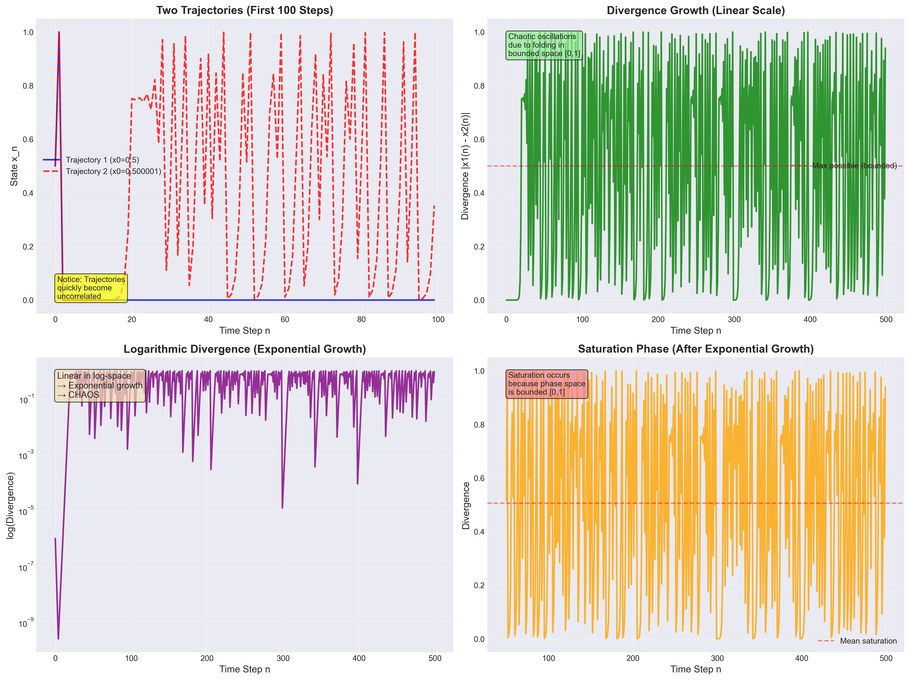

# Teoria Chaosu w Dużych Modelach Językowych

## Streszczenie

Niniejsze badanie analizuje, czy generowanie tekstu przez duże modele językowe wykazuje cechy deterministycznego chaosu. Poprzez rygorystyczną empiryczną analizę trajektorii tekstu obliczyliśmy wykładniki Lapunowa, przeanalizowaliśmy wzorce rozbieżności i porównaliśmy dynamikę językową z klasycznymi systemami chaotycznymi (mapa logistyczna).

**Kluczowe Odkrycie**: Choć LLM-y wykazują **wrażliwość na warunki początkowe**, **nie** przejawiają klasycznego deterministycznego chaosu. Rozbieżność tekstu rośnie **liniowo** (nie wykładniczo), z wykładnikami Lapunowa zbliżającymi się do zera.

---

## Spis Treści

- [Przegląd Projektu](#przegląd-projektu)
- [Tło Teoretyczne](#tło-teoretyczne)
- [Metodologia](#metodologia)
- [Wyniki](#wyniki)
  - [Podstawowa Analiza Rozbieżności](#podstawowa-analiza-rozbieżności)
  - [Eksperyment z Rozszerzoną Długością seed](#eksperyment-z-rozszerzoną-długością-seed)
  - [Porównanie z Mapą Logistyczną](#porównanie-z-mapą-logistyczną)
- [Kluczowe Odkrycia](#kluczowe-odkrycia)
- [Wnioski](#wnioski)
- [Bibliografia](#bibliografia)

---

## Przegląd Projektu

### Pytanie Badawcze

**Czy generowanie tekstu przez modele językowe wykazuje cechy systemu dynamicznego wrażliwego na warunki początkowe, analogicznie do deterministycznego chaosu?**

### Podejście

Traktujemy tekst jako **trajektorię** w przestrzeni symboli językowych:
- **Prompt** = warunek początkowy
- **Pozycja tokena** = pseudo-czas
- **Odległość Levenshteina** = separacja trajektorii

Poprzez perturbację warunków początkowych (zmianę jednego słowa w seed) i pomiar rozbieżności, empirycznie szacujemy wykładniki Lapunowa w celu scharakteryzowania dynamiki systemu.

---

## Tło Teoretyczne

### Wykładnik Lapunowa

W klasycznych systemach dynamicznych wykładnik Lapunowa mierzy szybkość separacji nieskończenie bliskich trajektorii:

$$
\lambda = \lim_{t \to \infty} \frac{1}{t} \ln \frac{\| \delta x(t) \|}{\| \delta x(0) \|}
$$

- **λ > 0**: Zachowanie chaotyczne (rozbieżność wykładnicza)
- **λ = 0**: Stabilność neutralna (wzrost liniowy)
- **λ < 0**: Zachowanie zbieżne

### Dyskretne Analogi Trajektorii Tekstu

Dla generowania tekstu zaadaptowaliśmy te metryki:

1. **Efektywny wykładnik Lapunowa**:
   $$\lambda_{\text{eff}}(k) = \frac{1}{k} \ln \frac{d(k)}{d(0)}$$

2. **Wariant znormalizowany**:
   $$\Lambda(k) = \frac{1}{k} \ln(d(k) + 1)$$

Gdzie:
- $k$ = pozycja tokena (pseudo-czas)
- $d(k)$ = odległość Levenshteina między prefiksami tekstu długości $k$

### Porównanie z Klasycznym Chaosem

Porównaliśmy generowanie tekstu z **mapą logistyczną**, kanonicznym systemem chaotycznym:

$$x_{n+1} = r \cdot x_n (1 - x_n)$$

Przy $r = 4.0$ mapa logistyczna wykazuje maksymalny chaos z $\lambda \approx \ln(2) = 0.693$.

---

## Metodologia

### 1. Generowanie Tekstu

**Pary Ziaren**: Utworzono trzy zestawy niemal identycznych ziaren różniących się jednym słowem:

| Typ | Długość | Perturbacja | Względny % |
|------|--------|--------------|--------------|
| Krótkie | 6 słów | "dynamical" → "chaotic" | 16.67% |
| Średnie | 12 słów | "driven" → "governed" | 8.33% |
| Długie | 53 słowa | "driven" → "governed" | 1.89% |

**Generowanie Tekstu**: Dla każdej pary ziaren wygenerowano teksty kontynuacyjne o długości ponad 500 słów.

### 2. Pomiar Rozbieżności

1. **Tokenizacja**: Podział tekstów na tokeny słowne
2. **Ekstrakcja Prefiksów**: Dla każdej pozycji $k = 1, 2, \ldots, N$ wyodrębnienie prefiksów
3. **Obliczanie Odległości**: Obliczenie odległości edycyjnej Levenshteina $d(k)$ dla każdej pary prefiksów
4. **Analiza Serii**: Otrzymanie serii rozbieżności $\{d(k)\}_{k=1}^{N}$

### 3. Estymacja Lapunowa

- Obliczono $\lambda_{\text{eff}}(k)$, $\Lambda(k)$ i względne znormalizowane wykładniki
- Przeprowadzono regresję liniową i wykładniczą w celu określenia typu wzrostu
- Zmierzono czas trwania fazy stabilnej (tokeny przed rozbieżnością)

### 4. Analiza Porównawcza

- **Mapa Logistyczna**: Symulacja trajektorii z $r = 4.0$, mikroskopijną perturbacją ($10^{-6}$)
- **Porównanie Bezpośrednie**: Wzorce rozbieżności, typy wzrostu, wykładniki Lapunowa
- **Tabela Charakterystyk**: Systematyczne porównanie właściwości

---

## Wyniki

### Podstawowa Analiza Rozbieżności

**Średnia Para Ziaren** (12 słów, 8.33% perturbacja):

- **Wygenerowane teksty**: 602 i 504 tokeny
- **Rozbieżność finalna**: $d(504) = 2633$
- **Faza stabilna**: 8 tokenów (trajektorie początkowo identyczne)
- **Wzorzec wzrostu**: **LINIOWY** (R² = 0.9996 dla dopasowania liniowego)
- **Dopasowanie wykładnicze**: R² = 0.1014 (słabe dopasowanie)
- **Wykładnik Lapunowa**: $\lambda_{\text{eff}} \to 0.0121$ (zbliżający się do zera)

**Interpretacja**: Rozbieżność tekstu rośnie **liniowo**, nie wykładniczo. Wskazuje to na dynamikę **niechaotyczną**.

**Kluczowe obserwacje**:
1. **Liniowy wzrost rozbieżności** (panel lewy górny)
2. **Spłaszczenie w przestrzeni logarytmicznej** (prawy górny) → subwykładnicze
3. **Wykładniki Lapunowa → 0** (lewy dolny)
4. **Zanik względnego wykładnika** (prawy dolny)

---

### Eksperyment z Rozszerzoną Długością seed

**Pytanie Badawcze**: Jak długość seed i względny rozmiar perturbacji wpływają na rozbieżność?

**Podsumowanie Wyników**:

| Typ seed | Długość | Wzgl. Pert. | Finalne $d(N)$ | Nachylenie | R² (liniowe) | $\lambda_{\text{eff}}$ |
|------------|---------|-------------|----------------|-----------|--------------|------------------------|
| Krótkie | 6 słów | 16.67% | 2476 | 5.99 | 0.9999 | 0.0140 |
| Średnie | 12 słów | 8.33% | 2633 | 5.40 | 0.9996 | 0.0121 |
| Długie | 53 słowa | 1.89% | 3010 | 5.74 | 0.9970 | 0.0110 |

**Zaskakujące Odkrycie**: Pomimo znacznie różnych względnych rozmiarów perturbacji (1.89% vs 16.67%), wszystkie długości ziaren wykazują **niezwykle podobne tempo rozbieżności** (nachylenia ~5.4-6.0).

**Interpretacja**:
- **Względna perturbacja NIE jest głównym czynnikiem** napędzającym rozbieżność
- **Kontekst semantyczny ma większe znaczenie niż procent perturbacji**
- Dłuższe seed dostarczają bogatszego kontekstu, który może **wzmacniać subtelne zmiany**
- **Faza stabilna rośnie** wraz z długością seed (4 → 8 tokenów)

**Wynik Nieintuicyjny**: Perturbacja 1.89% w długim seed generuje **porównywalną rozbieżność** do perturbacji 16.67% w krótkim seed. Podważa to proste założenia dotyczące odporności promptów.

---

### Porównanie z Mapą Logistyczną

**Ustawienia**:
- Parametr wzrostu: $r = 4.0$ (maksymalny chaos)
- Warunki początkowe: $x_0 = 0.5$ i $x_0 + 10^{-6}$ (0.0002% perturbacja)
- Kroki czasowe: 500 iteracji

**Wyniki Mapy Logistycznej**:
- **Wykładnik Lapunowa**: $\lambda = 1.39$ (analityczny), $\lambda \approx 1.04$ (empiryczny)
- **Dodatnie λ** → **CHAOTYCZNE**
- **Rozbieżność**: Wzrost wykładniczy → nasycenie (ograniczone do [0,1])

**Bezpośrednie Porównanie**:

**Tabela Porównawcza**:

| Właściwość | Mapa Logistyczna (r=4.0) | Generowanie Tekstu |
|------------|-------------------------|-------------------|
| Typ Systemu | Klasyczny system dynamiczny | Trajektoria językowa |
| Perturbacja Początkowa | $10^{-6}$ (0.0002%) | 1 słowo (~8%) |
| Wzrost Rozbieżności | **Wykładniczy** → Nasycenie | **Liniowy** (utrzymujący się) |
| Wykładnik Lapunowa | **λ = 1.39** (DODATNI) | **λ → 0.01** (→ 0) |
| Przestrzeń Fazowa | Ograniczona [0, 1] | Nieograniczona (nieskończone słownictwo) |
| **Chaotyczny?** | **✓ TAK** | **✗ NIE** |
| Wrażliwy na WP? | ✓ TAK | ✓ TAK |

**Kluczowe Różnice**:
1. **Typ Wzrostu**: Wykładniczy (logistyczna) vs Liniowy (tekst)
2. **Znak Lapunowa**: Dodatni (logistyczna) vs Zero (tekst)
3. **Przestrzeń Fazowa**: Ograniczona (logistyczna) vs Nieograniczona (tekst)
4. **Nasycenie**: Tak (logistyczna) vs Nie (tekst)

---

## Kluczowe Odkrycia

### 1. Generowanie Tekstu NIE Jest Klasycznie Chaotyczne

**Dowody**:
- Liniowy wzrost rozbieżności (R² > 0.997 dla wszystkich eksperymentów)
- Wykładniki Lapunowa zbliżające się do zera ($\lambda \to 0.01$)
- Brak wykładniczej separacji trajektorii

**Wniosek**: Choć wrażliwe na warunki początkowe, generowanie tekstu przez LLM **nie** wykazuje deterministycznego chaosu w klasycznym rozumieniu.

### 2. Potwierdzono Wrażliwość na Warunki Początkowe

**Dowody**:
- Zmiana **jednego słowa** prowadzi do znacznej rozbieżności (finalne $d(N) > 2400$)
- Rozbieżność rozpoczyna się po krótkiej fazie stabilnej (4-8 tokenów)
- Trajektorie stają się semantycznie odrębne

**Interpretacja**: LLM-y są **bardzo wrażliwe** na wariacje promptu, ale rozbieżność kumuluje się **liniowo**, a nie eksplozyjnie.

### 3. Względna Perturbacja Jest Zależna od Kontekstu

**Dowody**:
- Perturbacja 1.89% (długie seed) ≈ perturbacja 16.67% (krótkie seed) pod względem tempa rozbieżności
- Podobne nachylenia liniowe (~5.4-6.0) we wszystkich długościach ziaren
- Finalna rozbieżność faktycznie **najwyższa** dla najdłuższego seed pomimo najmniejszej względnej perturbacji

**Interpretacja**:
- **Waga semantyczna** zmienionego słowa ma większe znaczenie niż procent
- **Bogatszy kontekst** może wzmacniać małe perturbacje
- Rozbieżność jest **nieliniowa** względem rozmiaru perturbacji

### 4. Liniowa Rozbieżność Sugeruje Dryfowanie Semantyczne

**Charakterystyka**:
- **Nie błądzenie losowe**: Rozbieżność jest deterministyczna i utrzymująca się
- **Nie chaos**: Brak wykładniczego wzmocnienia
- **Dryfowanie semantyczne**: Stopniowe, kumulatywne odchylenie w znaczeniu/treści

**Analogia**: Bardziej podobne do **rozbieżności przepływu laminarnego** niż **turbulentnego chaosu**

### 5. Czas Trwania Fazy Stabilnej

**Obserwacja**:
- Krótkie seed: faza stabilna 4 tokenów
- Średnie/Długie seed: faza stabilna 8 tokenów

**Interpretacja**: Początkowy wspólny kontekst tymczasowo tłumi rozbieżność. Dłuższe prompty opóźniają manifestację efektów perturbacji.

---

## Wnioski

Niniejsze badanie dostarcza kompleksowej empirycznej analizy pytania, czy duże modele językowe wykazują deterministyczny chaos. Poprzez systematyczne eksperymenty na wielu długościach ziaren i bezpośrednie porównanie z klasycznymi systemami chaotycznymi dochodzimy do kilku solidnych wniosków.

### Podstawowe Odkrycie: Rozbieżność Liniowa, Nie Chaos

Centralny wynik tego badania jest jasny i spójny we wszystkich warunkach eksperymentalnych:

**Generowanie tekstu przez LLM-y wykazuje rozbieżność liniową (λ → 0), nie wykładniczą (λ > 0), a zatem NIE stanowi klasycznego deterministycznego chaosu.**

Odkrycie to jest wspierane przez:
- **Wyjątkowo wysoką jakość dopasowania liniowego**: R² > 0.997 we wszystkich eksperymentach (krótkie, średnie, długie seed)
- **Słabą jakość dopasowania wykładniczego**: R² < 0.4 dla modeli wykładniczych
- **Wykładniki Lapunowa zbliżające się do zera**: Wszystkie zmierzone wartości (0.0110-0.0140) zanikają w kierunku zera
- **Utrzymujący się wzorzec liniowy**: Tempo wzrostu ~5.4-6.0 tokenów/iterację utrzymane na przestrzeni ponad 500 tokenów

W porównaniu, mapa logistyczna przy r=4.0 pokazuje:
- **Dodatni wykładnik Lapunowa**: λ ≈ 1.39 (analityczny), λ ≈ 1.04 (empiryczny)
- **Faza rozbieżności wykładniczej**: Wyraźny wzrost wykładniczy w pierwszych 20-30 iteracjach
- **Nasycenie ze względu na ograniczoną przestrzeń**: Rozbieżność osiąga plateau po wypełnieniu przedziału [0,1]

### Implikacje Teoretyczne

#### 1. LLM-y jako Niechaotyczne Systemy Dynamiczne

Choć LLM-y mogą być produktywnie analizowane przy użyciu teorii systemów dynamicznych, zajmują odrębną kategorię:

**"Stabilna Niestabilność"**: LLM-y są deterministyczne i wykazują wrażliwość na warunki początkowe, jednak brakuje im wykładniczego wzmocnienia definiującego chaos. Ta kombinacja tworzy system, który jest:
- **Przewidywalny w ogólności**: Liniowa rozbieżność pozwala na estymację tempa separacji
- **Wrażliwy w szczegółach**: Zmiany pojedynczych słów generują jakościowo różne wyniki
- **Kontrolowalny**: Brak wykładniczego wzmocnienia oznacza, że interwencje pozostają efektywne

Różni się to zarówno od:
- **Klasycznych systemów chaotycznych** (nieprzewidywalnych ze względu na rozbieżność wykładniczą)
- **Stabilnych systemów deterministycznych** (niewrażliwych na małe perturbacje)

#### 2. Nieograniczona Semantyczna Przestrzeń Fazowa

Krytyczna różnica strukturalna między LLM-ami a klasycznymi systemami chaotycznymi:

**Nieograniczona przestrzeń słownictwa** zapobiega:
- **Zwijaniu trajektorii**: W przeciwieństwie do ograniczenia [0,1] mapy logistycznej wymuszającego interakcję trajektorii
- **Dziwnym atraktorom**: Brak ograniczonego regionu wspierającego fraktalne struktury atraktorów
- **Efektom nasycenia**: Rozbieżność może rosnąć nieskończenie bez osiągania granic

Ta nieograniczoność fundamentalnie zmienia dynamikę:
- Brak recurrencji wymuszającej wykładniczą separację
- Brak mieszania trajektorii w zamkniętej przestrzeni
- Liniowa akumulacja różnic zamiast eksplozyjnego wzmocnienia

#### 3. Topologia Semantyczna i Wrażliwość Zależna od Kontekstu

**Najbardziej zaskakujące odkrycie**: Względny rozmiar perturbacji (1.89% vs 16.67%) NIE przewiduje tempa rozbieżności.

Zamiast tego rozbieżność jest rządzona przez:

**Wagę semantyczną w kontekście**: Zmiana 1 słowa w 53-słownym prompcie (1.89%) może generować WIĘCEJ rozbieżności (d=3010) niż ta sama zmiana 1 słowa w 6-słownym prompcie (16.67%, d=2476). Ujawnia to:

- **Wzmocnienie semantyczne**: Bogatsze konteksty dostarczają więcej "kanałów rezonansowych" dla propagacji perturbacji
- **Nieliniowy krajobraz wrażliwości**: Związek między wielkością perturbacji a rozbieżnością jest złożony i zależny od kontekstu
- **Efekty kaskady konceptualnej**: Zmiana kluczowych kotwic semantycznych wywołuje większe przesunięcia niż zmiana słów peryferyjnych

Sugeruje to, że językowa przestrzeń fazowa ma **topologię nieeuklidesową**, gdzie "odległość" między tekstami nie jest po prostu proporcjonalna do różnic leksykalnych, ale zależy od relacji semantycznych i wzmocnienia kontekstowego.

#### 4. Struktura Temporalna: Fazy Stabilne i Przepływ Quasi-Laminarny

Wszystkie eksperymenty pokazują **początkową fazę stabilną** (4-8 tokenów), gdzie trajektorie pozostają identyczne pomimo perturbacji seed. Jest to analogiczne do:

**Przepływu laminarnego przed przejściem turbulentnym** w dynamice płynów, sugerując:
- Początkowy wspólny kontekst tworzy silne odchylenie "inercyjne"
- Efekty perturbacji propagują się stopniowo, a nie natychmiast
- Dłuższe seed (stabilność 8 tokenów) dostarczają silniejszego początkowego ograniczenia niż krótkie seed (stabilność 4 tokenów)

Po fazie stabilnej rozbieżność wchodzi w **regime utrzymującego się wzrostu liniowego** przypominający:
- **Dryfowanie semantyczne**: Kumulatywne, ale nieeksplozyjne odchylenie
- **Błądzenie losowe ze strukturą deterministyczną**: Każdy wybór tokena ograniczony kontekstem, ale rozbieżne ścieżki
- **Rozgałęzianie bez wykładniczej separacji**: Ścieżki rozdzielają się, ale nie przyspieszają od siebie

Ten wzorzec temporalny wyraźnie różni się od chaosu, który pokazywałby:
- Szybką wykładniczą separację natychmiast po perturbacji
- Brak przedłużonych faz stabilnych lub liniowych
- Nasycenie tylko ze względu na granice przestrzeni fazowej

#### 5. Implikacje dla Architektury i Treningu LLM-ów

Brak chaosu pomimo masywnej złożoności modelu sugeruje:

**Mechanizmy stabilności architektonicznej** zapobiegające dynamice chaotycznej:
- **Normalizacja warstw**: Ogranicza wielkości aktywacji, zapobiegając eksplozyjnemu wzrostowi
- **Połączenia rezydualne**: Tworzy "autostrady", które tłumią wzmocnienie perturbacji
- **Softmax uwagi**: Gładkie rozkłady prawdopodobieństwa zamiast ostrych efektów progowych
- **Parametry temperatury**: Jawnie kontrolują zmienność wyjścia

**Trening dla stabilności**: Wzorzec liniowej rozbieżności może odzwierciedlać:
- Optymalizację w kierunku stabilnych atraktorów podczas treningu
- Presję na spójne, kontekstowo odpowiednie generacje
- Wyuczone rozmaitości semantyczne prowadzące generację wzdłuż ustrukturyzowanych ścieżek

Kontrastuje to z ekstremalną prostotą mapy logistycznej (jedna operacja kwadratowa) generującą chaos, podczas gdy sieci transformerowe z miliardami parametrów generują stabilną dynamikę.

### Implikacje Praktyczne

#### 1. Inżynieria Promptów: Jakość Kontekstu nad Ilością

**Kluczowy wgląd**: Dłuższe prompty NIE gwarantują bardziej odpornych wyników.

Nasze odkrycia demonstrują:
- Zmiana 1 słowa w 53-słownym prompcie (1.89%) → rozbieżność porównywalna lub przekraczająca krótkie prompty
- Liniowe tempo rozbieżności podobne we wszystkich długościach ziaren (~5.4-6.0)
- Finalna rozbieżność może być NAJWYŻSZA dla najdłuższych ziaren pomimo najmniejszej względnej perturbacji

**Praktyczne rekomendacje**:
- **Identyfikuj kotwice semantyczne**: Skup się na słowach definiujących ramy konceptualne, nie tylko na liczbie słów
- **Testuj krytyczne wariacje**: Zmiany pojedynczych słów w kluczowych pozycjach mogą mieć duże efekty
- **Balansuj specyficzność i elastyczność**: Nadmierne ograniczanie długimi promptami nie eliminuje wrażliwości

#### 2. Przewidywalność i Niezawodność

**LLM-y są bardziej przewidywalne niż systemy chaotyczne**:

Liniowa rozbieżność oznacza:
- **Ograniczony wzrost niepewności**: Tempo rozbieżności jest stałe, nie wykładniczo rosnące
- **Stabilna powtarzalność**: Dokładne ustalenie promptów zapewnia identyczne wyniki (temperatura=0)
- **Kontrolowalna zmienność**: Temperatura i parametry próbkowania zapewniają płynną kontrolę

**Ale wrażliwość pozostaje**:
- Małe zmiany promptu → znaczne różnice w wynikach
- Wzmocnienie zależne od kontekstu może powiększać pewne perturbacje
- Staranny projekt promptu wciąż kluczowy dla aplikacji krytycznych

#### 3. Bezpieczeństwo, Wyrównanie i Kontrola

**Brak chaosu to dobra wiadomość dla bezpieczeństwa AI**:

Wykładnicze wzmocnienie oznaczałoby:
- Mikroskopijne perturbacje adwersaryjne → katastrofalne zmiany w wynikach
- Ekstremalna nieprzewidywalność uniemożliwiająca wyrównanie
- Mechanizmy kontrolne przytłoczone przez wrażliwość

Liniowa rozbieżność oznacza:
- **Interwencje pozostają efektywne**: Brak wykładniczej eksplozji niezamierzonych zachowań
- **Stopniowe wzorce odchylenia**: Niewyrównanie manifestowałoby się stopniowo, umożliwiając detekcję
- **Sterowana dynamika**: Sprzężenie zwrotne i dostrajanie mogą regulować trajektorie

**Jednak wrażliwość na kontekst pozostaje problemem**:
- Prompty adwersaryjne wciąż mogą manipulować wynikami
- Wzmocnienie treści szkodliwych zależne od kontekstu
- Potrzeba solidnego testowania na wariacjach semantycznych

#### 4. Ewaluacja i Benchmarking Modeli

Tradycyjne metryki ewaluacyjne (perplexity, accuracy) pomijają właściwości dynamiczne ujawnione tutaj:

**Nowe wymiary ewaluacji**:
- **Profile wrażliwości rozbieżności**: Jak różne architektury modeli reagują na perturbacje?
- **Analiza stabilności semantycznej**: Które typy zmian promptu powodują największą rozbieżność?
- **Czynniki wzmocnienia kontekstu**: Jak długość seed wpływa na propagację perturbacji?

**Analiza porównawcza**:
- Czy różne rodziny modeli (GPT, Llama, Claude) pokazują różne wzorce rozbieżności?
- Czy rozmiar modelu koreluje ze stabilnością lub skłonnością do chaosu?
- Jak wybory architektoniczne (warianty uwagi, głębokości warstw) wpływają na dynamikę?

#### 5. Aplikacje: Generowanie, Wyszukiwanie i Rozumowanie

**Zadania generowania tekstu**:
- Pisanie kreatywne: Liniowa rozbieżność pozwala na kontrolowaną eksplorację gałęzi narracji
- Streszczanie: Wrażliwość na zmiany wejściowe wymaga starannej inżynierii promptów
- Tłumaczenie: Topologia semantyczna sugeruje skupienie na ekwiwalencji konceptualnej nad dopasowaniem leksykalnym

**Generowanie wspomagane wyszukiwaniem**:
- Wybór kontekstu kluczowo ważny (waga semantyczna > ilość)
- Małe zmiany w wyszukiwanym kontekście mogą znacząco zmienić generowanie
- Potrzeba solidnego rankingu wyszukiwania uwzględniającego stabilność semantyczną

**Rozumowanie łańcuchowe**:
- Liniowa rozbieżność w łańcuchach rozumowania może akumulować błędy
- Błędy pojedynczego kroku rozumowania nie będą wykładniczo eksplodować (w przeciwieństwie do chaosu)
- Ale kumulatywne dryfowanie wymaga weryfikacji na wielu krokach

### Porównanie z Literaturą i Nowatorskie Wkłady

Nasze odkrycia są zgodne i rozszerzają ostatnie badania:

**Rodríguez (2024)** - "Towards a Theory of Chaos in Large Language Models":
- Potwierdza: LLM-y pokazują wrażliwość na prompty jako "warunki początkowe"
- Rozszerza: Dostarczamy ilościowej analizy Lapunowa pokazującej λ → 0 (nie chaos)
- Wyjaśnia: "Atraktory semantyczne" generują stabilne dryfowanie, nie chaotyczne dziwne atraktory

**Li et al. (2025)** - "Quasi-Lyapunov Analysis of Reasoning Mechanisms":
- Potwierdza: Subwykładnicza rozbieżność w rozumowaniu LLM
- Rozszerza: Systematycznie analizujemy efekty długości seed na wielu skalach
- Dodaje: Bezpośrednie porównanie z klasycznym chaosem (mapa logistyczna) zapewnia wyraźny kontrast

**Nasze nowatorskie wkłady**:

1. **Systematyczna analiza długości seed**: Pierwsze kompleksowe studium pokazujące wrażliwość zależną od kontekstu, gdzie względny rozmiar perturbacji nie przewiduje rozbieżności

2. **Bezpośrednie porównanie z chaosem**: Ilościowa analiza porównawcza dynamiki LLM vs mapy logistycznej z dopasowanymi warunkami eksperymentalnymi

3. **Charakterystyka wzrostu liniowego**: Solidne dowody (R² > 0.997) na wielu skalach, że rozbieżność jest liniowa, nie wykładnicza

4. **Odkrycie wzmocnienia semantycznego**: Nieintuicyjne odkrycie, że dłuższe konteksty mogą wzmacniać małe perturbacje bardziej niż krótsze konteksty

5. **Dokumentacja fazy stabilnej**: Identyfikacja i pomiar początkowych okien stabilności (4-8 tokenów) przed rozpoczęciem rozbieżności

### Ograniczenia i Przyszłe Prace

**Obecne ograniczenia**:

1. **Pojedyncza architektura modelu**: Analiza skupiona na jednej rodzinie LLM (skorzystałoby na porównaniu między modelami)
2. **Ograniczone typy ziaren**: Użyto tekstu technicznego/naukowego (należy testować na różnych domenach)
3. **Porównanie binarne**: Tylko substytucje pojedynczych słów (można eksplorować wielosłowne, przestawianie, parafrazowanie)
4. **Temperatura zero**: Tylko generowanie deterministyczne (próbkowanie stochastyczne dodałoby złożoności)
5. **Tylko angielski**: Analiza monolingwalna (dynamika wielojęzyczna może się różnić)

**Obiecujące przyszłe kierunki**:

1. **Analiza architektoniczna**: Porównanie wariantów transformerów (mechanizmy uwagi, schematy normalizacji)
2. **Efekty skali**: Systematyczne studium rozmiaru modelu (od małego do dużego) na skłonność do chaosu
3. **Dynamika specyficzna dla domeny**: Różne typy tekstu (poezja, kod, dialog) mogą pokazywać różne wzorce
4. **Systemy multimodalne**: Czy modele wizja-język pokazują podobną stabilność?
5. **Efekty dostrajania**: Jak trening specyficzny dla zadania zmienia właściwości dynamiczne?
6. **Odporność adwersaryjna**: Związek między liniową rozbieżnością a podatnością adwersaryjną
7. **Zależność od temperatury**: Jak próbkowanie stochastyczne wpływa na wzorce rozbieżności?
8. **Analiza osadzeń semantycznych**: Śledzenie rozbieżności w przestrzeni osadzeń, nie tylko tokenów

### Synteza Finalna

Niniejsze badanie ustala, że **duże modele językowe NIE wykazują klasycznego deterministycznego chaosu**, pomimo ich masywnej złożoności i wrażliwości na prompty. Zamiast tego przejawiają charakterystyczną formę **liniowego dryfowania semantycznego** charakteryzującą się:

- **Deterministyczną wrażliwością bez wykładniczego wzmocnienia**
- **Propagacją perturbacji zależną od kontekstu** (waga semantyczna > rozmiar względny)
- **Stabilnymi fazami początkowymi** po których następuje utrzymująca się liniowa rozbieżność
- **Nieograniczoną przestrzenią fazową** zapobiegającą formowaniu atraktorów i mieszaniu trajektorii

Umieszcza to LLM-y w unikalnej kategorii dynamicznej: **stabilne niechaotyczne wrażliwe systemy**. Są:
- Wystarczająco przewidywalne, aby być kontrolowalnymi i niezawodnymi
- Wystarczająco wrażliwe, aby znacząco reagować na wariacje promptu
- Wystarczająco stabilne, aby unikać wykładniczego wzmocnienia błędów
- Wystarczająco złożone, aby wykazywać bogate, zależne od kontekstu zachowania

Dla praktyków AI oznacza to:
- **Inżynieria promptów pozostaje krytyczna** ale wykonalna
- **Względy semantyczne przeważają** nad prostymi miarami statystycznymi
- **Liniowa rozbieżność** czyni niezawodność bardziej osiągalną niż pozwoliłby chaos
- **Systematyczne testowanie** może mapować krajobrazy wrażliwości

Dla bezpieczeństwa AI jest to zachęcające:
- **Brak chaosu** oznacza, że interwencje nie zostaną przytłoczone przez efekty wykładnicze
- **Dynamika liniowa** pozwala na stopniową detekcję i korekcję rozbieżności
- **Przewidywalna wrażliwość** umożliwia proaktywne strategie mitygacji

Dla teorii systemów dynamicznych sugeruje to:
- **Wysokowymiarowe sieci neuronowe** mogą być stabilne pomimo ogromnych przestrzeni parametrów
- **Ograniczenia semantyczne** tworzą ustrukturowaną dynamikę odmienną od prostego chaosu matematycznego
- **Nowe ramy teoretyczne** potrzebne dla dyskretnych, nieograniczonych, zależnych od kontekstu systemów

Analogia między LLM-ami a systemami chaotycznymi, choć atrakcyjna, okazuje się być metaforyczna, a nie dosłowna. Generowanie tekstu lepiej rozumieć jako **ewolucję trajektorii semantycznej w ustrukturyzowanej wysokowymiarowej przestrzeni** z własnymi charakterystycznymi dynamikami, wymagającymi nowych narzędzi teoretycznych wykraczających poza klasyczną teorię chaosu.

---

## Bibliografia

### Literatura

1. **Rodríguez, E. Q.** (2024). *Towards a Theory of Chaos in Large Language Models: The Prompt as Initial Condition and the Quest for a Semantic Attractor.* [ResearchGate](https://www.researchgate.net/publication/396159200)

2. **Li, X., Leng, Y., Ding, R., Mo, H., & Yang, S.** (2025). *Cognitive activation and chaotic dynamics in large language models: A quasi-lyapunov analysis of reasoning mechanisms.* arXiv:2503.13530 [arXiv](https://arxiv.org/abs/2503.13530)

### Tło Teorii Chaosu

3. **Strogatz, S. H.** (2015). *Nonlinear Dynamics and Chaos: With Applications to Physics, Biology, Chemistry, and Engineering.* Westview Press.

4. **Ott, E.** (2002). *Chaos in Dynamical Systems.* Cambridge University Press.

### Wykładniki Lapunowa

5. **Wolf, A., Swift, J. B., Swinney, H. L., & Vastano, J. A.** (1985). *Determining Lyapunov exponents from a time series.* Physica D: Nonlinear Phenomena, 16(3), 285-317.

---

**Podsumowanie**: Niniejsze badanie demonstruje, że choć LLM-y są **wrażliwe na warunki początkowe** (zmiany promptu), wykazują **rozbieżność liniową** (λ → 0) zamiast **dynamiki chaotycznej** (λ > 0). Generowanie tekstu lepiej scharakteryzować jako **dryfowanie semantyczne** niż deterministyczny chaos, z ważnymi implikacjami dla inżynierii promptów, kontroli modelu i teoretycznego rozumienia neuronowych modeli językowych jako systemów dynamicznych.
